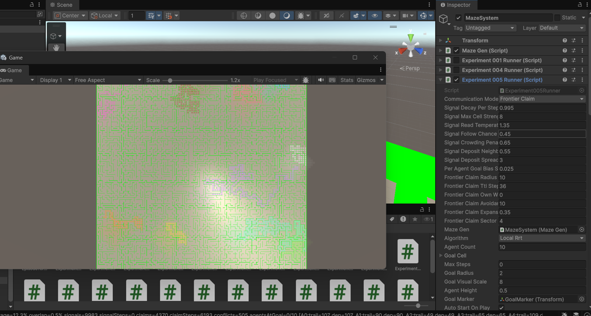

# MazeLifeLab Experiment Journal

Research results · markdown source → HTML build

_Generated by `Tools/build_journal.py`. Do not hand-edit; edit `reports/*.md` or `journal.manifest.json` instead._

## Unity scenes

| Scene | Experiment | Runners | Notes |
|-------|------------|---------|-------|
| `Assets/Scenes/EXP-005.unity` | EXP-005 | Experiment005Runner (FrontierClaim, LocalRrt) | Renamed from `Assets/Scenes/SampleScene.unity` |
| `Assets/Scenes/EXP-SWARM-005.unity` | EXP-SWARM-005 | ExperimentSwarm004Runner + ExperimentSwarmTrailAblationHarness |  |

## Report index

| Date | Experiment | Status | Unity scene | Report |
|------|------------|--------|-------------|--------|
| 2026-06-20 | EXP-005 — Frontier Claim Visual Observation | Qualitative only — no CSV batch | `Assets/Scenes/EXP-005.unity` | [Markdown](reports/2026-06-20_exp-005_frontier_claim_visual_observation.md) · [HTML](index.html#exp-005-frontier-claim-visual-2026-06-20) |
| 2025-06-24 | EXP-SWARM-005 — Scent Trail Ablation | Negative result — trails not working | `Assets/Scenes/EXP-SWARM-005.unity` | [Markdown](reports/2025-06-24_exp-swarm-005_trail_ablation.md) · [HTML](index.html#exp-swarm-005-trail-ablation-2025-06-24) |

---

<!-- report: exp-005-frontier-claim-visual-2026-06-20 -->

# EXP-005 — Frontier Claim Visual Observation

- **Date:** 2026-06-20
- **Experiment ID:** EXP-005
- **Status:** completed — qualitative visual observation (no quantitative batch)
- **Runner / harness:** `Experiment005Runner` on `MazeSystem` (no batch harness)
- **Seeds / conditions:** single Play-mode session; maze generated in scene (28×28 visible in Inspector)
- **Related code:** `Experiment005Runner`, `MazeFrontierClaimField`, `AgentStigmergyController`, `MazeStigmergyVisualizer`, `LocalRrtAgent`
- **Unity scene:** `Assets/Scenes/EXP-005.unity` (renamed from `Assets/Scenes/SampleScene.unity`) — `Experiment005Runner` on `MazeSystem`; other experiment runners disabled
- **Protocol doc:** `docs/experiment_005_multi_agent_signals.md`

---

## 1. Research Question

Does the **FrontierClaim** communication mode produce visibly distinct, slowly expanding exploration territories when multiple agents explore the same maze under partial observability?

This session was **not** a controlled ablation. It was a live visual check of whether claim-guided agents spread outward from stratified starts instead of collapsing into one crowded region.

---

## 2. Protocol Summary

1. Open **`Assets/Scenes/EXP-005.unity`** (formerly `SampleScene.unity`).
2. Enable `Experiment005Runner` on `MazeSystem`; disable competing experiment runners.
3. Set **Communication Mode** to `FrontierClaim`, **Algorithm** to `LocalRrt`, **Agent Count** to 10.
4. Enter Play mode and watch the Game view over time.
5. **No CSV batch was run** for this session; evaluation was by eye only.
6. Capture one late-episode screenshot for the journal (`docs/journal/screenshots/scr2.png`).

---

## 3. Configuration

| Parameter | Value (from screenshot / Inspector) |
|-----------|-------------------------------------|
| Runner | `Experiment005Runner` |
| Communication mode | `FrontierClaim` |
| Algorithm | `LocalRrt` |
| Agent count | 10 |
| Maze size | 28 × 28 |
| Frontier claim radius | 10 cells |
| Frontier claim TTL | 36 steps |
| Frontier claim avoidance weight | 10 |
| Frontier claim expansion weight | 0.35 |
| Signal decay per step | 0.995 |
| Signal follow chance | 0.45 |
| Signal crowding penalty | 0.65 |
| Stigmergy field visible | yes (`showStigmergyField`) |

Each agent is drawn with a **distinct color** (cyan, magenta, yellow, orange, and others from the runner palette). Deposited smell and visited trails tint the maze floor in that agent’s color, so territorial spread is readable at a glance.

---

## 4. Results

### Quantitative metrics

**None recorded for this session.**

`Experiment005MetricsLogger` exists and can write `results/experiment_005_multi_agent_signals.csv`, but this run was not logged as a formal episode batch. The bottom status bar showed live counters (e.g. frontier conflicts, per-agent claim/trail hints) during Play mode; those values were **not** saved or averaged.

### Qualitative observations (visual, in dynamics)

*Figure: Late-episode Game view (2026-06-20). Agents leave color-coded trails and claim regions on a 28×28 maze. Source: `docs/journal/screenshots/scr2.png`*

Watching the simulation over time:

- Agents **explore slowly**, extending colored corridors and patches into unexplored green maze space rather than jumping instantly across the map.
- **Territories remain visually separable**: cyan, magenta, yellow, and orange regions occupy different branches and wings of the maze, consistent with per-agent responsibility claims and avoidance of peers’ claimed frontiers.
- Expansion is **gradual and outward**: trails lengthen along corridors; local blobs are less dominant than in early FrontierClaim prototypes (smell deposited once per cell, farthest-tier frontier preference).
- A **bright goal marker** sits near the maze centre; at the time of the screenshot, exploration had not yet converged on a single team completion event (typical for a mid/late visual check, not a timed success run).
- **Overlap and conflict** appear in places where corridors narrow or two agents approach the same junction — expected under claim radius overlap; the HUD reported non-zero frontier conflict activity during the session.

**Informal takeaway:** FrontierClaim produces **readable, color-coded territorial expansion** suitable for qualitative inspection. This does **not** prove coordination benefit over EXP-004 `None` or other EXP-005 modes without a seeded CSV comparison.

---

## 5. Interpretation

The run supports the **visual design goal** of EXP-005 FrontierClaim: multiple agents can co-explore one maze while leaving distinguishable, slowly growing regions. Claim refresh, stratified starts, and peer-avoidance appear to reduce the “single crowded blob near spawn” failure mode described in earlier project notes.

Because no metrics were collected, we cannot say whether coverage, overlap, time-to-first-goal, or claim efficiency improved versus baselines. The session is evidence that the **phenomenon is observable and worth measuring**, not that FrontierClaim **works** in a scientific sense.

---

## 6. Limitations

- Single anecdotal Play-mode session; no fixed seed documentation in this report.
- No CSV export, no repeat runs, no comparison to `None`, `Trail`, or EXP-004.
- Visual judgment only — easy to over-interpret pleasing color patterns as coordination.
- Screenshot is one time slice; dynamics mattered more than the still frame.
- Goal-reaching and team success were not validated quantitatively here.

---

## 7. Decision Gate

| Question | Answer |
|----------|--------|
| Reproducible? | Partially — same runner/settings should reproduce similar visuals; seed not recorded for this entry. |
| Metrics trustworthy? | N/A — no metrics captured. |
| Beats or clarifies baselines? | Unknown — visual only. |
| Failure modes understood? | Partially — junction overlap and slow expansion observed; not counted. |
| Next experiment justified? | Yes — follow with seeded CSV runs across communication modes. |

**Decision:** Treat as **visual validation only**. Proceed to quantitative EXP-005 ablation when ready; do not treat this screenshot as proof of coordination benefit.

---

## 8. Recommended Next Step

1. Run seeded episodes (e.g. seed 42) for `None`, `Trail`, and `FrontierClaim` with metrics logging enabled.
2. Log team coverage %, overlap %, `frontier_claims_created`, `claim_conflicts`, and `steps_to_first_goal`.
3. Capture paired screenshots at matched step counts for the journal.
4. Compare against EXP-004 on the same seed before advancing to EXP-006.

---

## 9. Artifacts

- Screenshot (2026-06-20): `docs/journal/screenshots/scr2.png`
- Unity scene: `Assets/Scenes/EXP-005.unity`
- Markdown: this file
- HTML: [../index.html#exp-005-frontier-claim-visual-2026-06-20](../index.html#exp-005-frontier-claim-visual-2026-06-20)
- Optional future CSV: `results/experiment_005_multi_agent_signals.csv` (not produced in this session)

---

<!-- report: exp-swarm-005-trail-ablation-2025-06-24 -->

# EXP-SWARM-005 — Scent Trail Ablation (Batch Test)

- **Date:** 2025-06-24
- **Experiment ID:** EXP-SWARM-005
- **Status:** completed — negative result
- **Runner / harness:** `ExperimentSwarm004Runner` + `ExperimentSwarmTrailAblationHarness`
- **Seeds / conditions:** seeds `42`, `137` × conditions `without trails`, `with trails` (4 runs total)
- **Related code:** `SwarmScentField`, `SwarmTrailAblationEvaluator`, `ExperimentSwarmTrailAblationHarness`
- **Unity scene:** `Assets/Scenes/EXP-SWARM-005.unity` — `ExperimentSwarm004Runner`, `ExperimentSwarmTrailAblationHarness`, `MazeGen` on `MazeSystem`
- **Git reference:** `f2c668a` (harness and evaluator on `main`)

---

## 1. Research Question

Do decaying scent trails improve bee-hive foraging compared to the same swarm without trails, as measured by food return, foraging efficiency, time to first food, and revisit ratio?

---

## 2. Protocol Summary

1. Open **`Assets/Scenes/EXP-SWARM-005.unity`**.
2. Disable `Auto Start On Play` on the foraging runner.
3. Confirm `ExperimentSwarmTrailAblationHarness` is on `MazeSystem`.
4. Press **Run All Tests** in Play mode.
5. Harness runs four episodes automatically:
   - seed 42, scent off
   - seed 42, scent on
   - seed 137, scent off
   - seed 137, scent on
6. `SwarmTrailAblationEvaluator` compares means and assigns verdict.

**Pass criteria (automated):**

- Trail runs must show scent deposits and scent-influenced steps > 0.
- At least **2 of 3** primary metrics must improve:
  - mean food returned ≥ **+5%**
  - mean foraging efficiency ≥ **+5%**
  - mean time to first food ≥ **+10%** (lower is better)
- Mean revisit ratio must not worsen by more than **+5%**.

---

## 3. Configuration

| Parameter | Value |
|-----------|-------|
| Agent count | 96 |
| Max steps | 7000 |
| Food sites | 5 |
| Food units per site | 24 |
| Total food target | 120 returns |
| Test seeds | 42, 137 |
| Scent enabled runs | `enableScentTrails = true` |
| Default scent weight | 10 |
| Return trail deposit | 1.4 |
| Food discovery deposit | 2.5 |
| Scent decay per step | 0.985 |

**Baseline context:** EXP-SWARM-004 foraging was visually validated earlier (agents discover red food, return to blue hive).

---

## 4. Results

### Without trails (baseline)

| Metric | Value |
|--------|-------|
| Runs | 2 |
| Mean food returned | **37.0** / 120 |
| Mean foraging efficiency | **0.000055** |
| Mean time to first food | **863** steps |
| Mean revisit ratio | **0.999** |
| Mean scent deposits | 0.0 |
| Mean scent-influenced steps | 0.0 |

**Per-run food returned:** seed 42 = **49**, seed 137 = **25**

**Per-run efficiency:** seed 42 = **0.000073**, seed 137 = **0.000037**

### With trails (treatment)

| Metric | Value |
|--------|-------|
| Runs | 2 |
| Mean food returned | **31.5** / 120 |
| Mean foraging efficiency | **0.000047** |
| Mean scent deposits | > 0 (trails active) |
| Mean scent-influenced steps | > 0 (trails active) |

Trails were **biologically active** in code (deposits and steering occurred) but **underperformed** the baseline on primary task metrics.

### Deltas and verdict

| Delta (with vs without) | Approx. change |
|-------------------------|----------------|
| Food returned | **−14.9%** (worse) |
| Foraging efficiency | **−14.5%** (worse) |
| Primary metrics passed | **0 / 2** |

**Automated verdict:** `TRAILS NOT WORKING`

**Summary:** Scent trails with current deposit/follow rules **reduced** food collection and efficiency versus no trails. This is a valid negative ablation result, not an inconclusive run.

*Figure: Unity Inspector — EXP-SWARM-005 batch verdict (2025-06-24). File: `docs/journal/screenshots/scr1.png`*

---

## 5. Interpretation

### What seems valid

- Batch harness, live Inspector stats, and automated evaluator ran end-to-end.
- Baseline and treatment used identical seeds and episode caps.
- Scent mechanism activated in treatment runs (non-zero deposits and scent-influenced steps).

### What is not proven

- That scent trails can never help — only that **this deposit model** (continuous return-path deposit + gradient following for searchers) did not help.
- That results generalize beyond two seeds (high variance: 49 vs 25 without trails).

### Likely failure modes

1. **Return-path deposits attract searchers toward the hive**, not toward undiscovered food.
2. **Scent weight too high** — excessive scent-following reduced exploration and direct foraging bias.
3. **Revisit ratio ~0.999 in both conditions** — swarm already over-revisits; trails did not broaden search.
4. **Small sample size** — two seeds is enough for a first gate, not for a final scientific claim.

---

## 6. Limitations

- Only **2 seeds** × **2 conditions** (4 episodes).
- Episodes may have timed out before collecting all 120 food units.
- No dedicated `ExperimentSwarm005Runner`; scent is toggled on `ExperimentSwarm004Runner`.
- Game view OSD may clip at some zoom levels; Inspector panel was used for final readings.
- Unity physics-time estimate ~4–6 minutes per full batch; wall-clock may differ under load.

---

## 7. Decision Gate

| Gate | Answer |
|------|--------|
| Reproducible? | **Partially** — same seeds should rerun same layout; batch harness makes reruns easy. |
| Metrics trustworthy? | **Yes for relative comparison** within this harness; absolute efficiency values are small decimals by design. |
| Beats or clarifies baseline? | **Clarifies baseline** — trails hurt under current rules. |
| Failure modes understood? | **Partially** — hive-biased trails and over-revisiting are plausible; needs code experiment. |
| Next experiment justified? | **Yes** — revise trail semantics or tune parameters, then rerun ablation before EXP-SWARM-006. |

**Decision:** **Iterate EXP-SWARM-005** (do not advance to threats/roles yet).

---

## 8. Recommended Next Step (Simulation)

**Primary (recommended):** Fix trail semantics, then rerun the same 4-run batch.

1. **Food-biased deposits:** deposit strongly at food discovery/pickup; reduce or remove continuous return-path deposit.
2. **Lower `scentWeight`** (e.g. 10 → 3–5) so foraging and exploration biases dominate.
3. **Rerun** `ExperimentSwarmTrailAblationHarness` with seeds 42 and 137.
4. If still negative, add **2 more seeds** (e.g. 200, 300) before pivoting.

**Secondary:** Document tuned parameters in a follow-up journal entry `YYYY-MM-DD_exp-swarm-005_trail_ablation_retry.md`.

**Do not start yet:** EXP-SWARM-006 (Threat / Predator Response) until trail ablation either passes or is formally abandoned with documented reasoning.

---

## 9. Artifacts

- Inspector verdict panel (screenshot, 2025-06-24): `docs/journal/screenshots/scr1.png`
- Unity scene: `Assets/Scenes/EXP-SWARM-005.unity`
- Optional CSV if `logBatchRunsToCsv` enabled on harness
- Markdown: this file
- HTML: [../index.html#exp-swarm-005-trail-ablation-2025-06-24](../index.html#exp-swarm-005-trail-ablation-2025-06-24)

---

## Research Notes (short)

EXP-SWARM-005 batch ablation on 2025-06-24 found **scent trails harmful** under current rules (mean food 31.5 with trails vs 37.0 without). Verdict: **TRAILS NOT WORKING**. Next: food-biased pheromone deposit model and lower scent weight, then rerun ablation.

---
