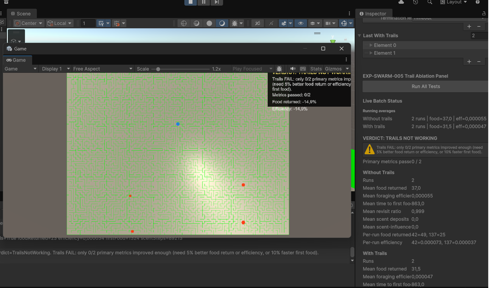

# EXP-SWARM-005 — Scent Trail Ablation (Batch Test)

- **Date:** 2025-06-24
- **Experiment ID:** EXP-SWARM-005
- **Status:** completed — negative result
- **Runner / harness:** `ExperimentSwarm004Runner` + `ExperimentSwarmTrailAblationHarness`
- **Seeds / conditions:** seeds `42`, `137` × conditions `without trails`, `with trails` (4 runs total)
- **Related code:** `SwarmScentField`, `SwarmTrailAblationEvaluator`, `ExperimentSwarmTrailAblationHarness`
- **Unity scene:** `Assets/Scenes/EXP-SWARM-005.unity` — `ExperimentSwarm004Runner`, `ExperimentSwarmTrailAblationHarness`, `MazeGen` on `MazeSystem`
- **Git reference:** `f2c668a` (harness and evaluator on `main`)

---

## 1. Research Question

Do decaying scent trails improve bee-hive foraging compared to the same swarm without trails, as measured by food return, foraging efficiency, time to first food, and revisit ratio?

---

## 2. Protocol Summary

1. Open **`Assets/Scenes/EXP-SWARM-005.unity`**.
2. Disable `Auto Start On Play` on the foraging runner.
3. Confirm `ExperimentSwarmTrailAblationHarness` is on `MazeSystem`.
4. Press **Run All Tests** in Play mode.
5. Harness runs four episodes automatically:
   - seed 42, scent off
   - seed 42, scent on
   - seed 137, scent off
   - seed 137, scent on
6. `SwarmTrailAblationEvaluator` compares means and assigns verdict.

**Pass criteria (automated):**

- Trail runs must show scent deposits and scent-influenced steps > 0.
- At least **2 of 3** primary metrics must improve:
  - mean food returned ≥ **+5%**
  - mean foraging efficiency ≥ **+5%**
  - mean time to first food ≥ **+10%** (lower is better)
- Mean revisit ratio must not worsen by more than **+5%**.

---

## 3. Configuration

| Parameter | Value |
|-----------|-------|
| Agent count | 96 |
| Max steps | 7000 |
| Food sites | 5 |
| Food units per site | 24 |
| Total food target | 120 returns |
| Test seeds | 42, 137 |
| Scent enabled runs | `enableScentTrails = true` |
| Default scent weight | 10 |
| Return trail deposit | 1.4 |
| Food discovery deposit | 2.5 |
| Scent decay per step | 0.985 |

**Baseline context:** EXP-SWARM-004 foraging was visually validated earlier (agents discover red food, return to blue hive).

---

## 4. Results

### Without trails (baseline)

| Metric | Value |
|--------|-------|
| Runs | 2 |
| Mean food returned | **37.0** / 120 |
| Mean foraging efficiency | **0.000055** |
| Mean time to first food | **863** steps |
| Mean revisit ratio | **0.999** |
| Mean scent deposits | 0.0 |
| Mean scent-influenced steps | 0.0 |

**Per-run food returned:** seed 42 = **49**, seed 137 = **25**

**Per-run efficiency:** seed 42 = **0.000073**, seed 137 = **0.000037**

### With trails (treatment)

| Metric | Value |
|--------|-------|
| Runs | 2 |
| Mean food returned | **31.5** / 120 |
| Mean foraging efficiency | **0.000047** |
| Mean scent deposits | > 0 (trails active) |
| Mean scent-influenced steps | > 0 (trails active) |

Trails were **biologically active** in code (deposits and steering occurred) but **underperformed** the baseline on primary task metrics.

### Deltas and verdict

| Delta (with vs without) | Approx. change |
|-------------------------|----------------|
| Food returned | **−14.9%** (worse) |
| Foraging efficiency | **−14.5%** (worse) |
| Primary metrics passed | **0 / 2** |

**Automated verdict:** `TRAILS NOT WORKING`

**Summary:** Scent trails with current deposit/follow rules **reduced** food collection and efficiency versus no trails. This is a valid negative ablation result, not an inconclusive run.

*Figure: Unity Inspector — EXP-SWARM-005 batch verdict (2025-06-24). File: `docs/journal/screenshots/scr1.png`*

---

## 5. Interpretation

### What seems valid

- Batch harness, live Inspector stats, and automated evaluator ran end-to-end.
- Baseline and treatment used identical seeds and episode caps.
- Scent mechanism activated in treatment runs (non-zero deposits and scent-influenced steps).

### What is not proven

- That scent trails can never help — only that **this deposit model** (continuous return-path deposit + gradient following for searchers) did not help.
- That results generalize beyond two seeds (high variance: 49 vs 25 without trails).

### Likely failure modes

1. **Return-path deposits attract searchers toward the hive**, not toward undiscovered food.
2. **Scent weight too high** — excessive scent-following reduced exploration and direct foraging bias.
3. **Revisit ratio ~0.999 in both conditions** — swarm already over-revisits; trails did not broaden search.
4. **Small sample size** — two seeds is enough for a first gate, not for a final scientific claim.

---

## 6. Limitations

- Only **2 seeds** × **2 conditions** (4 episodes).
- Episodes may have timed out before collecting all 120 food units.
- No dedicated `ExperimentSwarm005Runner`; scent is toggled on `ExperimentSwarm004Runner`.
- Game view OSD may clip at some zoom levels; Inspector panel was used for final readings.
- Unity physics-time estimate ~4–6 minutes per full batch; wall-clock may differ under load.

---

## 7. Decision Gate

| Gate | Answer |
|------|--------|
| Reproducible? | **Partially** — same seeds should rerun same layout; batch harness makes reruns easy. |
| Metrics trustworthy? | **Yes for relative comparison** within this harness; absolute efficiency values are small decimals by design. |
| Beats or clarifies baseline? | **Clarifies baseline** — trails hurt under current rules. |
| Failure modes understood? | **Partially** — hive-biased trails and over-revisiting are plausible; needs code experiment. |
| Next experiment justified? | **Yes** — revise trail semantics or tune parameters, then rerun ablation before EXP-SWARM-006. |

**Decision:** **Iterate EXP-SWARM-005** (do not advance to threats/roles yet).

---

## 8. Recommended Next Step (Simulation)

**Primary (recommended):** Fix trail semantics, then rerun the same 4-run batch.

1. **Food-biased deposits:** deposit strongly at food discovery/pickup; reduce or remove continuous return-path deposit.
2. **Lower `scentWeight`** (e.g. 10 → 3–5) so foraging and exploration biases dominate.
3. **Rerun** `ExperimentSwarmTrailAblationHarness` with seeds 42 and 137.
4. If still negative, add **2 more seeds** (e.g. 200, 300) before pivoting.

**Secondary:** Document tuned parameters in a follow-up journal entry `YYYY-MM-DD_exp-swarm-005_trail_ablation_retry.md`.

**Do not start yet:** EXP-SWARM-006 (Threat / Predator Response) until trail ablation either passes or is formally abandoned with documented reasoning.

---

## 9. Artifacts

- Inspector verdict panel (screenshot, 2025-06-24): `docs/journal/screenshots/scr1.png`
- Unity scene: `Assets/Scenes/EXP-SWARM-005.unity`
- Optional CSV if `logBatchRunsToCsv` enabled on harness
- Markdown: this file
- HTML: [../index.html#exp-swarm-005-trail-ablation-2025-06-24](../index.html#exp-swarm-005-trail-ablation-2025-06-24)

---

## Research Notes (short)

EXP-SWARM-005 batch ablation on 2025-06-24 found **scent trails harmful** under current rules (mean food 31.5 with trails vs 37.0 without). Verdict: **TRAILS NOT WORKING**. Next: food-biased pheromone deposit model and lower scent weight, then rerun ablation.
