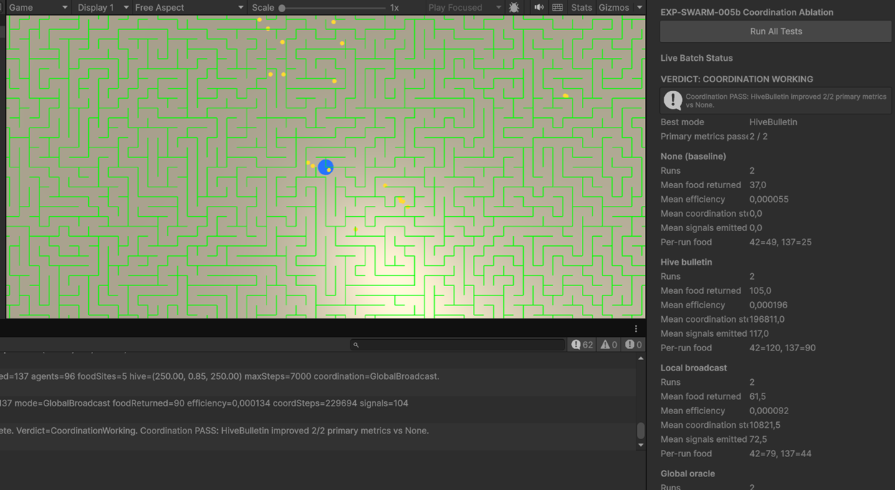

# EXP-SWARM-005b — Food Coordination Ablation (Batch Test)

- **Date:** 2026-06-24
- **Experiment ID:** EXP-SWARM-005b
- **Status:** completed — positive result
- **Runner / harness:** `ExperimentSwarm004Runner` + `ExperimentSwarmCoordinationAblationHarness`
- **Seeds / conditions:** seeds `42`, `137` × modes `None`, `HiveBulletin`, `LocalBroadcast`, `GlobalBroadcast` (8 runs total)
- **Related code:** `SwarmFoodCoordinationSystem`, `SwarmFoodCoordinationEvaluator`, `ExperimentSwarmCoordinationAblationHarness`
- **Unity scene:** `Assets/Scenes/EXP-SWARM-005.unity` — coordination harness enabled; legacy trail harness disabled
- **Prior context:** EXP-SWARM-005 scent trails paused (`TRAILS NOT WORKING`, 2025-06-24)

---

## 1. Research Question

Does **explicit food coordination** (hive bulletin, local broadcast, global oracle) improve bee-hive foraging versus independent searchers, with scent **gradient following** disabled?

---

## 2. Protocol Summary

1. Open **`Assets/Scenes/EXP-SWARM-005.unity`**.
2. Disable `Auto Start On Play` on the foraging runner.
3. Confirm `ExperimentSwarmCoordinationAblationHarness` is enabled on `MazeSystem`.
4. Press **Run All Tests** in Play mode.
5. Harness runs eight episodes automatically (per seed: None → HiveBulletin → LocalBroadcast → GlobalBroadcast).
6. `SwarmFoodCoordinationEvaluator` compares each treatment mean vs **None** and assigns verdict.

**Pass criteria (automated):**

- Non-None modes must show `coordination_influenced_steps` > 0.
- At least **2 of 3** primary metrics must improve vs None:
  - mean food returned ≥ **+5%**
  - mean foraging efficiency ≥ **+5%**
  - mean time to first food ≥ **+10%** (lower is better)
- Mean revisit ratio must not worsen by more than **+5%**.

---

## 3. Configuration

| Parameter | Value |
|-----------|-------|
| Agent count | 96 |
| Max steps | 7000 |
| Food sites | 5 |
| Food units per site | 24 |
| Total food target | 120 returns |
| Test seeds | 42, 137 |
| Scent trails | **off** (`enableScentTrails = false`) |
| Coordination modes | None, HiveBulletin, LocalBroadcast, GlobalBroadcast |

---

## 4. Results

### None (baseline)

| Metric | Value |
|--------|-------|
| Runs | 2 |
| Mean food returned | **37.0** / 120 |
| Mean foraging efficiency | **0.000055** |
| Mean coordination-influenced steps | **0.0** |
| Mean signals emitted | **0.0** |

**Per-run food returned:** seed 42 = **49**, seed 137 = **25**

### HiveBulletin (best mode)

| Metric | Value |
|--------|-------|
| Runs | 2 |
| Mean food returned | **105.0** / 120 |
| Mean foraging efficiency | **0.000196** |
| Mean coordination-influenced steps | **196,811.0** |
| Mean signals emitted | **117.0** |

**Per-run food returned:** seed 42 = **120**, seed 137 = **90**

### LocalBroadcast

| Metric | Value |
|--------|-------|
| Runs | 2 |
| Mean food returned | **61.5** / 120 |
| Mean foraging efficiency | **0.000092** |
| Mean coordination-influenced steps | **10,821.5** |
| Mean signals emitted | **72.5** |

**Per-run food returned:** seed 42 = **79**, seed 137 = **44**

### GlobalBroadcast (oracle)

| Metric | Value |
|--------|-------|
| Runs | 2 |
| Mean food returned | *(panel partially clipped in screenshot)* |
| Console (last run, seed 137) | foodReturned=**90**, efficiency=**0.000134**, coordSteps=**229,694**, signals=**104** |

Global oracle likely performs in the same ballpark as HiveBulletin on these seeds; Inspector panel was clipped at the bottom of the capture. Console confirms coordination was highly active on the final run.

### Deltas vs None (HiveBulletin)

| Delta | Approx. change |
|-------|----------------|
| Food returned | **+183.8%** |
| Foraging efficiency | **+256.4%** |
| Primary metrics passed | **2 / 2** |

**Automated verdict:** `COORDINATION WORKING`

**Summary:** Hive bulletin improved **2/2** primary metrics vs independent searchers. Local broadcast also passed thresholds on food and efficiency (+66% food) but **underperformed hive bulletin** on both seeds.

*Figure: Unity Inspector — EXP-SWARM-005b batch verdict (2026-06-24). File: `docs/journal/screenshots/scr3.png`*

---

## 5. Interpretation

### What seems valid

- Batch harness, live Inspector stats, and automated evaluator ran end-to-end across **8 runs**.
- Coordination mechanism was **active** in all non-None modes (large `coordination_influenced_steps` counts).
- **Hive bulletin** dramatically raised food return on **both** seeds (49→120, 25→90).
- Result directionally **opposes** EXP-SWARM-005 scent trails (trails hurt; explicit signals help).

### What is not yet proven

- Generalization beyond two seeds (high baseline variance: 49 vs 25 without coordination).
- That **local broadcast** cannot match hive bulletin after radius / weight tuning.
- Whether **global oracle** exceeds hive bulletin — panel was clipped; evaluator tie-break favours first mode with equal pass count (HiveBulletin evaluated before GlobalBroadcast).
- Optimal `coordinationWeight`, TTL, and crowding penalties.

### Likely explanations

1. **Discrete food-site coordinates** match the foraging task better than continuous hive-biased scent gradients.
2. **Hive bulletin** gives all searchers persistent, fresh targets without requiring agents to be in broadcast range.
3. **Local broadcast** may lose signal propagation in a large maze — fewer agents receive leads early in the episode.
4. High coordination step counts suggest steering bias is strong; tuning may trade exploration for exploitation.

---

## 6. Limitations

- Only **2 seeds** × **4 modes** (8 episodes).
- No CSV file saved (`logBatchRunsToCsv` was off); metrics taken from Inspector + Console.
- GlobalBroadcast mean row incomplete in screenshot.
- Episodes may time out before all 120 food units are collected.
- Evaluator does not break ties by higher food delta when pass counts are equal.

---

## 7. Decision Gate

| Gate | Answer |
|------|--------|
| Reproducible? | **Partially** — same seeds should rerun same layout; batch harness makes reruns easy. |
| Metrics trustworthy? | **Yes for relative comparison** within this harness. |
| Beats or clarifies baseline? | **Beats baseline** — hive bulletin ~2.8× mean food vs None. |
| Failure modes understood? | **Partially** — local broadcast weaker than hive; global ceiling not fully logged. |
| Next experiment justified? | **Yes** — validate on more seeds and tune local broadcast before EXP-SWARM-006. |

**Decision:** **Accept EXP-SWARM-005b Phase 1 gate** — explicit hive bulletin coordination works under current rules. **Do not** resume scent gradient following as primary mechanism.

---

## 8. Recommended Next Step (Simulation)

**Primary (recommended):** Confirm robustness, then tune local mode.

1. **Rerun with CSV logging** — enable `logBatchRunsToCsv` on harness; archive `results/experiment_swarm_005b_food_coordination.csv`.
2. **Add seeds 200, 300** (4 seeds × 4 modes = 16 runs) before claiming general improvement.
3. **Tune LocalBroadcast** — try larger `broadcastRadius` and/or higher pickup signal weight; compare again vs HiveBulletin.
4. **Document GlobalBroadcast** means in a follow-up run if oracle ceiling matters for agenda planning.

**Secondary:** Consider EXP-SWARM-005c (deferred “quantum sensing” sketch) only after local vs hive gap is understood.

**Do not start yet:** EXP-SWARM-006 (Threat / Predator Response) until coordination gains are confirmed on ≥4 seeds.

---

## 9. Artifacts

- Inspector verdict panel (screenshot, 2026-06-24): `docs/journal/screenshots/scr3.png`
- Unity scene: `Assets/Scenes/EXP-SWARM-005.unity`
- Markdown: this file
- HTML: [../index.html#exp-swarm-005b-coordination-ablation-2026-06-24](../index.html#exp-swarm-005b-coordination-ablation-2026-06-24)

---

## Research Notes (short)

EXP-SWARM-005b batch ablation on 2026-06-24 found **explicit food coordination helpful**: HiveBulletin mean food **105.0** vs None **37.0** (+184%). Verdict: **COORDINATION WORKING**. Local broadcast helped (+66% food) but less than hive bulletin. Next: more seeds, CSV logging, local broadcast tuning.
